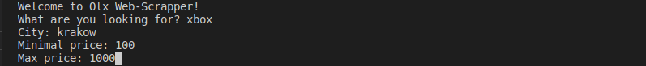
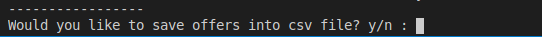

# Olx-Scrapper
I've created this simple script when I was tired of endless refreshing while waiting for new offers :>

## How to use?
1.Clone code
```
git clone https://github.com/jacobwojcik/Olx-Scrapper.git
cd Olx-Scrapper
```
2.Install dependencies
```
pip3 install -r requirements.txt
```
3.Run script
```
python3 main.py
```
Then you will be asked few questions in your terminal to specify what are you looking for:



At the end you can also save results into CSV file:


